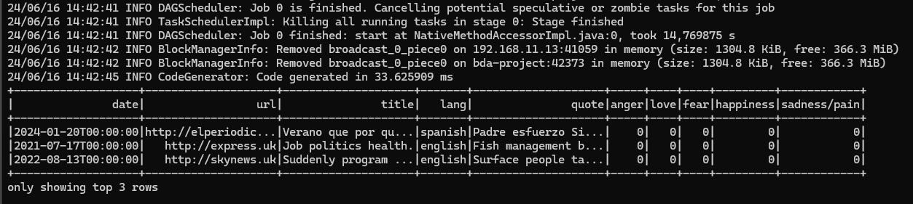

# Proyecto Final Big Data Aplicado
## Curso Especialización Inteligencia Articicial y Big Data (2023-2024)
## Contenidos

### [1. Requisitos](#1-Requisitos)
### [2. Objetivo final](#2-objetivo-final)
### [3. Descripción del proyecto](#3-descripción-del-proyecto)
### [4. Información sobre los datos](#4-información-sobre-los-datos)
#### [4.1. Estructura de los datos](#41-estructura-de-los-datos)
### [5. Estructura del proyecto](#5-estructura-del-proyecto)
#### [5.1. Herramientas necesarias](#51-herramientas-necesarias)
#### [5.2. Configuración del entorno](#52-configuración-del-entorno)
### [6. Entorno Kafka](#6-entorno-kafka)
### [7. Despliegue](#7-despliegue)
#### [7.1. Levantar sistemas](#71-levantar-sistemas)
#### [7.1.1. Hadoop](#711-hadoop)
#### [7.1.3. Spark](#712-spark)
#### [7.1.4. Iniciar el sistema de Kafka](#713-iniciar-el-sistema-de-kafka)
#### [7.2. Creación del topic](#72-creación-del-topic)
#### [7.3. Ejecución del generador de datos sintéticos](#73--ejecución-del-generador-de-datos-sintéticos)
#### [7.4. Ejecución del consumidor de datos sintéticos](#74-ejecución-del-consumidor-de-datos-sintéticos)
#### [7.5. Verificación persistencia de datos](#75-verificación-persistencia-datos)
### [8. Visualización en PowerBI](#8-visualización-en-powerbi)
#### [8.1. Imagen 1: datos generales](#81-imagen-1-datos-generales)
#### [8.2. Imagen 2: cronología](#82-imagen-2-cronología)
#### [8.3. Imagen 3: URLs](#83-imagen-3-urls)
### [9. Autora](#9-autora)


### 1. Requisitos
- El proyecto deberá tener todo el stack de todos los sistemas vistos en clase perfectamente instalado, configurado y funcionando como un Sistema completo de Big Data, desde la ingesta de datos, ETL, BI y su visualización.
- El alumnado elegirá el origen, los tipos y la temática de los datos que se van a procesar en el Sistema Big Data.
- Deben establecer, desarrollar y justificar el tipo de conocimiento que van a obtener de los datos origen después de su ingesta y procesamiento (ETL) en el sistema. 
- El procesamiento de los datos lo realizarán a través de SPARK, utilizando alguna de sus 3 APIs disponible. Esto no quita que puedan realizar algún tipo de procesamiento de datos anteriormente, como por ejemplo en Kafka.
- El sistema debe poder soportar la ingesta de datos tanto en batch como en streaming.
- Los datos de origen podrán ser sintéticos, reales o una combinación de ambos.
- Puedes usar las Api/s que creas necesaria/s. Incluso la creación de tus propios datos sintéticos en batch y streaming (Estos deben cumplir con los requisitos del puntos 1 al 3)
- Todo el ETL realizado deberá estar correctamente desarrollado y justificado.
- Se deberá añadir al stack algún sistema, servicio, ... de investigación propia (al menos 1, aunque puede añadir todos los que quieras). Se propone una lista de ellos, que podrán ser ampliados a propuesta del alumnado:
   1. AWS GLUE
   2. AWS S3
   3. Nifi
   4. Flink
   5. Tableau
   6. PowerBI
   7. Kibana
   8. Grafana
   9. Otros (deben ser consensuados y aprobado)

[subir ↑](#contenidos)

### 2. Objetivo final


*Fuente: [Pixabay](https://pixabay.com/es/photos/business-technology-ciudad-line-5475659/)*

A través de la ingesta en _stream_ de noticias mundiales y su correpondiente procesamiento en un sistema de Big Data, se pretende extraer conocimiento sobre los sentimientos evocados por el cuerpo de la noticia.

Para este cometido, se realizará un estudio comparativo entre artículos en inglés y español y se analizarán las diferencias lingüísticas y culturales en la expresión de emociones, así como su evolución a lo largo del tiempo. Este análisis permitirá identificar qué emociones predominan en cada idioma y cómo estas se manifiestan en distintos periodos de tiempo.

El objetivo final es obtener una comprensión más profunda de la interacción entre el lenguaje de las noticias y las emociones de las personas lectoras.

[subir ↑](#contenidos)


### 3. Descripción del proyecto

*Fuente: [Pixabay](https://pixabay.com/es/photos/ai-generado-cara-humana-cyborg-8229552/)*

Este proyecto se centra en el análisis de noticias de actualidad obtenidas en tiempo real y en la extracción, mediante técnicas de _machine learning_, de aquellos sentimientos que las mismas evocan. Para la implementación de este ecosistema se han utilizado soluciones Big Data. El objetivo final es predecir y entender las diferentes emociones provocadas por el contenido de las noticias,  teniendo en consideración factores como el idioma de la noticia o el momento en el que fue publicada.

La idea inicial de este proyecto era obtener los datos de la web [*The GDELT Project*](https://www.gdeltproject.org) (*Global Database of Events, Language, and Tone*), base de datos que monitorea noticias publicadas a nivel mundial, ya que permite obtener una cantidad considerable de datos adecuado para un ecosistema de Big Data. Sin embargo, teniendo en cuenta que la actualización de estos datos se produce cada 15 minutos, se ha considerado que no era un tiempo apropiado para un sistema en _streaming_, que es uno de los requisitos del proyecto. Por este motivo, se ha procedido a generar datos de manera sintética que por un lado, simulen con gran fidelidad la estructura de los datos que se extraerían  de GDELT, y por otro, que se generen con una frecuencia adecuada para poder crear un sistema Big Data en _streaming_. De esta manera, se consigue realizar un análisis de sentimientos en tiempo real, manteniendo la integridad y la estructura de los datos originales.

Una vez generados los datos, son ingeridos y procesados mediante la API de Spark, lo que permite aprovechar las capacidades de procesamiento en tiempo real y a gran escala de esta plataforma. En esta fase, se han aplicado técnicas de _machine learning_, en concreto procesamiento del lenguaje natural en español e inglés, para obtener un modelo multiclase que sea capaz de predecir la emoción que una texto periodístico es capaz de producir.

La última fase del flujo de datos es la visualización, la cual se realiza utilizando PowerBI. Mediante esta herramienta de visualización, se facilitará el análisis continuo y en profundidad de las tendencias emocionales capturadas en las noticias.

**Conclusión**
Este enfoque intenta maximizar la eficiencia en la obtención y análisis de datos y extraer conocimiento, basándose en visualizaciones actualizadas y detalladas. El monitoreo de los sentimientos y las respuestas emocionales a través de diferentes culturas y idiomas, proporciona una perspectiva única sobre la dinámica global del discurso mediático. 

En última instancia, el proyecto busca no solo entender mejor el panorama informativo mundial, sino también anticipar y responder a las tendencias globales en la percepción pública, ofreciendo un recurso útil para auellas peronas interesadas en el tema.
[subir ↑](#contenidos)

### 4. Información sobre los datos


*Fuente: [Web GDELT Project](https://www.gdeltproject.org)*

[*The GDELT Project*](https://www.gdeltproject.org) (*Global Database of Events, Language, and Tone*) es una vasta base de datos que monitorea las noticias de transmisión, prensa escrita y web de casi todos los rincones de cada país en más de 100 idiomas. Identifica a las personas, ubicaciones, organizaciones, temas, fuentes, emociones, recuentos, citas, imágenes y eventos que impulsan nuestra sociedad global cada segundo de cada día, creando una plataforma abierta y gratuita para computar sobre el mundo entero. Utiliza tecnologías avanzadas de procesamiento de lenguaje natural (NLP) y aprendizaje automático para extraer información de una amplia gama de fuentes mediáticas.

En este proyecto específicamente, se ha utilizado la base de datos [*Global Quotation Graph de GDELT*](https://blog.gdeltproject.org/announcing-the-global-quotation-graph/). Dicha base datos está diseñada para mapear y analizar las citas textuales de noticias globales, en 152 idiomas diferentes. Estas citas (*quotes*) de figuras públicas y otras fuentes importantes, intentan captar quién dijo qué, sobre qué tema y en qué contexto, proporcionando una visión profunda de la dinámica del discurso global.

Actualmente cubre noticias a nivel mundial monitoreadas por GDELT desde el 1 de enero de 2020 y, por lo tanto, abarca la mayor parte de la propagación global de la pandemia de Covid-19. Todos los tiempos están en UTC y los archivos se generan típicamente entre 2-5 minutos después del minuto actual. El conjunto de datos actualmente se genera con una frecuencia de 15 minutos.


*Fuente: [Global Quotation Graph](https://blog.gdeltproject.org/announcing-the-global-quotation-graph/)*

[subir ↑](#contenidos)

#### 4.1. Estructura de los datos

Cada minuto se actualiza el conjunto de datos y está en formato UTF8 JSONNL. Cada fila representando un artículo que contiene una o más citas:

- *date*: La fecha y hora en que el artículo fue visto por GDELT.
- *url*: La URL completa del artículo.
- *title*: El título del artículo.
- *quotes*: Un array que contiene una o más citas identificadas en el artículo.
   1. *pre*: Un breve fragmento de texto que precede a la cita hasta 100 caracteres para ayudar con la identificación del hablante. Este varía en tamaño según el idioma del artículo y las colas lingüísticas y típicamente será más corto de 100 caracteres.
   2. *quote*: La declaración citada en sí misma.
   3. *post*: Un breve fragmento de texto que sigue a la cita hasta 100 caracteres para ayudar con la identificación del hablante. Este varía en tamaño según el idioma del artículo y las colas lingüísticas, y generalmente tendrá menos de 100 caracteres.

[subir ↑](#contenidos)

### 5. Estructura del proyecto

#### 5.1. Herramientas necesarias

4 máquinas en Virtual Box con Ubuntu Server.

#### 5.2. Configuración del entorno

##### 1. Construcción de Hadoop.
- 1 master y 3 nodos.


<p style="font-size: 11px;"><em>Imagen: Contenido directorio Hadoop</em></p>


<p style="font-size: 11px;"><em>Imagen: Nodos Hadoop</em></p>

##### 2. Construcción del cluster Spark.
- 1 master y 3 nodos.


<p style="font-size: 11px;"><em>Imagen: Directorio principal Spark</em></p>

##### 3. Construcción del cluster Kafka.
- 1 master y 3 nodos.


<p style="font-size: 11px;"><em>Imagen: Directorio principal Kafka</em></p>

##### 4. Visualización.
- Aplicación PowerBI Desktop ara la visualización.


[subir ↑](#contenidos)

### 6. Entorno Kafka
Cluster de Kafka con 3 nodos usando KRaft (Kafka Raft Metadata Mode) con 2 brokers, un controlador y 3 workers.

#### Estructura de carpetas

**1. Directorio principal de Apache Kafka**

```sh
/opt/kafka_2.13-3.7.0
```

Contiene los archivos de configuración de Kafka.


<p style="font-size: 11px;"><em>Imagen: Contenido directorio Kafka</em></p>

**2. Directorio principal del proyecto**

```sh
/opt/kafka/gdelt
```
Contiene los archivos correspondientes al proyecto.


<p style="font-size: 11px;"><em>Imagen: Contenido directorio del proyecto</em></p>

**3. Directorio *config***

```sh
/opt/kafka/gdelt/config/
```

Contiene los archivos de configuración del controlador, 2 brokers y 3 workers.


<p style="font-size: 11px;"><em>Imagen: Contenido directorio config</em></p>

Se ha partido de la configuración por defecto que tienen los archivos originales de Kafka pero se han personalizado algunos parámetros. Puesto que cada broker de Kafka necesita un puerto único para evitar conflictos y permitir que se comuniquen correctamente, se han cambiado los puertos ya que en este proyecto está implementado en la misma máquina.

**controller1.properties**
```bash
############################# Log Basics #############################
log.dirs=/opt/kafka/gdelt/logs/controller1
```

**broker1.properties**
```bash
############################# Server Basics #############################
node.id=2

############################# Socket Server Settings #############################
listeners=PLAINTEXT://192.168.11.10:9094
advertised.listeners=PLAINTEXT://192.168.11.10:9094

############################# Log Basics #############################
log.dirs=/opt/kafka/gdelt/logs/broker1
```

**broker2.properties**
```bash
############################# Server Basics #############################
node.id=3

############################# Socket Server Settings #############################
listeners=PLAINTEXT://192.168.11.10:9095
advertised.listeners=PLAINTEXT://192.168.11.10:9095

############################# Log Basics #############################
log.dirs=/opt/kafka/gdelt/logs/broker2
```

**worker1.properties**
```bash
bootstrap.servers=192.168.11.10:9094,192.168.11.10:9095
group.id=connect-cluster
key.converter=org.apache.kafka.connect.json.JsonConverter
value.converter=org.apache.kafka.connect.json.JsonConverter
key.converter.schemas.enable=true
value.converter.schemas.enable=true
config.storage.topic=connect-configs
offset.storage.topic=connect-offsets
status.storage.topic=connect-status
config.storage.replication.factor=2
offset.storage.replication.factor=2
status.storage.replication.factor=2
plugin.path=/opt/kafka/gdelt/libs
listeners=http://localhost:8083
```

**4. Directorio *logs***
Archivos logs de controlador y brokers.

```sh
/opt/kafka/gdelt/logs/
```

<p style="font-size: 11px;"><em>Imagen: Contenido directorio logs</em></p>

**5. Directorio *svm-model***
<a href="https://scikit-learn.org/stable/modules/generated/sklearn.svm.SVC.html" style="font-size: 12px;">Scikit-Learn Support Vector Classification Documentation</a>
<a href="https://scikit-learn.org/stable/modules/generated/sklearn.multioutput.MultiOutputClassifier.html" style="font-size: 12px;">Scikit-Learn MultiOutputClassifier Documentation</a>


```sh
/opt/kafka/gdelt/svm-model/
```
Contiene todos los archivos relacionados a la creación del modelo para la predicción de sentimientos.


<p style="font-size: 11px;"><em>Imagen: Contenido directorio svm-model</em></p>

> **spanish-emotions-dataset.csv**

Contiene el [Corpus literario LiSSS de emociones en español](http://juanmanuel.torres.free.fr/corpus/lisss/). 

Esta dataset se usa para el entrenamiento del modelo. Está diseñado específicamente para estudiar cómo se expresan las emociones en español a través de textos literarios. Incluye una variedad de emociones etiquetadas que pueden ser utilizadas para entrenar modelos de _machine learning_ para reconocer y predecir emociones en otros textos en español.

> **spanish-model-creator**

A partir del dataset en español, este código implementa un sistema de clasificación de textos para identificar emociones en textos españoles utilizando _machine learning_. Primero, descarga recursos de [NLTK](https://www.nltk.org) como tokenizadores y [stopwords](https://pythonspot.com/nltk-stop-words/) en español. Define una función para preprocesar texto eliminando caracteres no alfabéticos y stopwords, y otra función para actualizar etiquetas de emociones basadas en identificadores. Carga un dataset de emociones desde un archivo CSV, procesa y limpia los datos. Convierte el texto a un formato numérico usando [TF-IDF](https://scikit-learn.org/stable/modules/generated/sklearn.feature_extraction.text.TfidfVectorizer.html#sklearn.feature_extraction.text.TfidfVectorizer)  y configura un pipeline con un clasificador SVM de múltiples salidas. Utiliza [GridSearchCV](https://scikit-learn.org/stable/modules/generated/sklearn.model_selection.GridSearchCV.html#gridsearchcv) para optimizar los parámetros del [SVM](https://scikit-learn.org/stable/modules/svm.html#svm). Entrena el modelo con los datos de entrenamiento transformados y lo guarda en un archivo  [pickle](https://docs.python.org/es/3/library/pickle.html), listo para usar en aplicaciones futuras. Finalmente, imprime una confirmación de que el modelo ha sido guardado exitosamente.

> **english-emotions-dataset.csv**

Contiene el [GoEmotions: A Dataset for Fine-Grained Emotion Classification](https://github.com/google-research/google-research/tree/master/goemotions). 

GoEmotions incluye un espectro amplio de emociones, categorizando los textos en 28 diferentes emociones detalladas, tales como alegría, tristeza, ira, amor, entre otros. Esto permite un análisis más específico que los típicos análisis de sentimiento positivo/negativo/neutro.

> **english-model-creator**

A partir del dataset en inglés, genera un archivo pickle que contiene el [modelo SVM](https://scikit-learn.org/stable/modules/svm.html), generado para predecir los sentimientos del texto de la noticia en inglés:  archivo _english-emotions-model.pkl_

A partir del dataset en inglés, este código combina técnicas de [NLP y machine learning](https://www.geeksforgeeks.org/natural-language-processing-nlp-tutorial/) para analizar sentimientos en textos. Utiliza [NLTK](https://www.nltk.org) para el preprocesamiento de textos en inglés, eliminando [stopwords](https://pythonspot.com/nltk-stop-words/) y filtrando palabras no alfabéticas. [Pandas](https://pypi.org/project/pandas/) maneja la manipulación de datos, seleccionando y renombrando columnas necesarias de un dataset de emociones. [Scikit-learn](https://scikit-learn.org/stable/index.html) facilita la división de datos, vectorización [TF-IDF](https://scikit-learn.org/stable/modules/generated/sklearn.feature_extraction.text.TfidfVectorizer.html#sklearn.feature_extraction.text.TfidfVectorizer) para conversión de texto a formato numérico, y la configuración de un pipeline con SVM para clasificación de múltiples etiquetas. [GridSearchCV](https://scikit-learn.org/stable/modules/generated/sklearn.model_selection.GridSearchCV.html#gridsearchcv) optimiza los parámetros del modelo [SVM](https://scikit-learn.org/stable/modules/svm.html#svm). Finalmente, el modelo entrenado y vectorizador se guardan usando [pickle](https://docs.python.org/es/3/library/pickle.html) para su uso posterior, asegurando la reutilización eficiente del modelo para nuevas predicciones de sentimientos.

**6. Directorio *src***
Directorio que contiene los ejecutables correspondientes al productor y al consumidor de Kafka.


<p style="font-size: 11px;"><em>Imagen: Contenido directorio src</em></p>

> **producer**

Programa que genera datos sintéticos que representan noticias en inglés y español utilizando la librería Faker y los envía a un tema de Kafka. Configura un productor de Kafka que se conecta al servidor. Faker genera frases y títulos en inglés, que se traducen al español si es necesario usando Google Translate. Los datos incluyen la fecha, el idioma, la frase, el título y una URL aleatoria. Para la generación de las fechas se ha establecido un intervalo que simula las fechas de publicación de GDELT. Con un bucle infinito, se genera un flujo en *streaming* mediante el cual se envían estos datos a Kafka, registrando cada mensaje y esperando un segundo antes de repetir el proceso. 


<p style="font-size: 11px;"><em>Imagen: Ejecución producer.py</em></p>

> **consumer**

Programa que implementa un *stream* de datos en tiempo real. Lee mensajes de un tema de Kafka, procesa los datos de texto usando NLTK, predice emociones utilizando un modelo SVM y escribe los datos transformados en HDFS en formato Parquet. La aplicación se construye utilizando Apache Spark. Primero, se verifican y descargan los recursos necesarios de NLTK. Luego, se crea una sesión de Spark y se define el esquema para los datos entrantes. El flujo de datos se lee de Kafka, se filtran las entradas en español, se preprocesa el texto, se aplica el modelo SVM para predecir emociones y finalmente, se almacenan los resultados en HDFS.

[subir ↑](#contenidos)

### 7. Despliegue

#### 7.1. Levantar sistemas

#### 7.1.1. Hadoop

```bash
cd $HADOOP_HOME
stop-dfs.sh
start-dfs.sh

# Comprobar modo seguro
hdfs dfsadmin -safemode get
hdfs dfsadmin -safemode leave

# Comprobar el estado de los nodos de HDFS
hdfs dfsadmin -report

# Comprobar el espacio en disco disponible en HDFS
hdfs dfs -df -h
```


<p style="font-size: 11px;"><em>Imagen: Levantando Hadoop</em></p>

#### 7.1.2. Spark

```bash
cd $SPARK_HOME
./sbin/start-master.sh
./sbin/start-workers.sh
```


<p style="font-size: 11px;"><em>Imagen: Levantando Spark Master</em></p>


<p style="font-size: 11px;"><em>Imagen: Levantando Spark Nodos</em></p>

#### 7.1.3. Iniciar el sistema de Kafka

- Eliminar logs antiguos (en caso necesario)

```bash
sudo rm -r /opt/kafka/gdelt/logs/*
```

- Generar un UUID para el cluster
```bash
KAFKA_CLUSTER_ID="$(bin/kafka-storage.sh random-uuid)"
echo $KAFKA_CLUSTER_ID
```


- Formatear el almacenamiento para el controlador y los brokers

```bash
bin/kafka-storage.sh format -t $KAFKA_CLUSTER_ID -c /opt/kafka/gdelt/config/controller1.properties
bin/kafka-storage.sh format -t $KAFKA_CLUSTER_ID -c /opt/kafka/gdelt/config/broker1.properties
bin/kafka-storage.sh format -t $KAFKA_CLUSTER_ID -c /opt/kafka/gdelt/config/broker2.properties
```


- Iniciar controlador, brokers y workers

```bash
bin/kafka-server-start.sh /opt/kafka/gdelt/config/controller1.properties
bin/kafka-server-start.sh /opt/kafka/gdelt/config/broker1.properties
bin/kafka-server-start.sh /opt/kafka/gdelt/config/broker2.properties
bin/connect-distributed.sh /opt/kafka/gdelt/config/worker1.properties
```


#### 7.2. Creación del topic

[kafka-topics-documentation](#https://kafka.apache.org/documentation/#topicconfigs)

Este comando crea un topic llamado gdelt-news en el cluster de Kafka accesible a través del servidor 192.168.11.10:9094. El topic tendrá 2 particiones y cada partición tendrá 2 réplicas, lo que ayuda a asegurar la disponibilidad y la durabilidad de los datos en el cluster de Kafka.

```bash
bin/kafka-topics.sh --create --topic gdelt-news --bootstrap-server 192.168.11.10:9094 --replication-factor 2 --partitions 2
```


**Otros comandos útiles**

- Para consumir mensajes del topic gdelt-news desde el principio (es decir, desde el primer mensaje):

```bash
bin/kafka-console-consumer.sh --bootstrap-server 192.168.11.10:9094 --topic gdelt-news --from-beginning
```
- Eliminar un topic

```bash
bin/kafka-topics.sh --delete --bootstrap-server 192.168.11.10:9094 --topic gdelt-news
```

- Listar todos los topics

```bash
bin/kafka-topics.sh --list --bootstrap-server 192.168.11.10:9094
```


#### 7.3. Ejecución del generador de datos sintéticos

```bash
cd /opt/kafka/gdelt/src/
python3 producer.py 
```
Este programa produce y envía continuamente datos sintéticos a Kafka, simulando un flujo de datos relacionados con noticias del mundo.

La estructura de los datos generados es la siguiente:

```python
{
   'date': '1992-08-19T13:52:06.328552', 
   'lang': 'spanish', 
   'quote': 'Este es el texto de una noticia.', 
   'title': 'Este es el título de la noticia.', 
   'url': 'https://example.es'
}
```


<p style="font-size: 11px;"><em>Imagen: Generación de datos sintéticos con Kafka en Python</em></p>


<p style="font-size: 11px;"><em>Imagen: Consumo de mensajes de un topic de Kafka desde el primer mensaje disponible</em></p>

#### 7.4. Ejecución del consumidor de datos sintéticos

```bash
cd /opt/hadoop-3.3.6/spark-3.5.0
spark-submit --packages org.apache.spark:spark-sql-kafka-0-10_2.12:3.5.0 --master spark://192.168.11.10:7077 /opt/kafka/gdelt/src/consumer.py
```


<p style="font-size: 11px;"><em>Imagen: Ejecución del consumidor de Kafka</em></p>

#### 7.5. Verificación persistencia datos

Podemos observar cómo se guardan los datos tanto por consola como por interfaz gráfica.

```bash
hdfs dfs -ls /kafka/data/
```


<p style="font-size: 11px;"><em>Imagen: Datos guardados en HFDS</em></p>

[Browse Directory de Hadoop](http://192.168.57.10:9870/explorer.html#/bda/kafka/gdelt/data)


<p style="font-size: 11px;"><em>Imagen: Visualización de datos en Hadoop</em></p>


### 8. Visualización en PowerBi

Para proceder a la visualización debemos descargar los datos a local.

```bash
# De HDFS a local
hdfs dfs -get /kafka/data/*.parquet /opt/kafka/gdelt/data  
# Desde local a equipo
scp -r uservob@192.168.57.10:/opt/kafka/gdelt/data/ .\
```

Tras la importación de los archivos parquets a PowerBI, se crean las siguientes medidas:

- Total Rows = COUNTROWS('news')
- Count Spanish Rows = CALCULATE(COUNTROWS('news'), 'news'[lang] = "spanish")
- Count English Rows = CALCULATE(COUNTROWS('news'), 'news'[lang] = "english")
- Porcentaje URL = COUNTROWS('news') / CALCULATE(COUNTROWS('news'), ALL('news'[url])) * 100


Se han efectuado 3 visualizaciones:

#### 8.1. Imagen 1: Datos generales


<p style="font-size: 11px;"><em>Imagen: PowerBI. Datos Generales</em></p>

##### 1. Descripción
Se presentan los datos generales y las proporciones de distintos sentimientos asociados con las noticias en cada idioma. 

##### 2. Datos Generales
Estos números muestran que, de un total de 1730 noticias analizadas, aproximadamente el 48% están en inglés y el 52% en español.

##### 3. Distribución de Sentimientos
Las noticias en inglés muestran una mayor proporción de sentimientos de _love_ (50%) comparado con las noticias en español (33.21%).
_Anger_ y _happiness_ aparecen con mayor frecuencia en las noticias en inglés comparadas con las de español. Esto podría indicar una tendencia de los medios en inglés a enfocar más en estos sentimientos o simplemente reflejar diferencias culturales en la cobertura de noticias.
En español, los sentimientos están más equitativamente distribuidos entre _anger_, _happiness_, _fear_, _sadness_/_pain_ y _love_, lo que puede sugerir una variedad más amplia de temas o tonos en las noticias.

#### 8.2. Imagen 2: Cronología


<p style="font-size: 11px;"><em>Imagen: PowerBI. Datos Generales</em></p>

##### 1. Descripción
La imagen muestra dos gráficos de líneas que representan la "Evolución cronológica de los sentimientos" asociados a noticias en español e inglés desde 2020 hasta 2024. Cada línea en los gráficos representa un tipo de sentimiento específico y su variación en el tiempo. 

##### 2. Cronología – Noticias en Español
- _Anger_ (Azul): Fluctuaciones moderadas, con un pico en 2022 y una disminución notable hacia 2024.
- _Sadness_/_Pain_ (Añil): Incremento significativo hacia 2021, seguido de una disminución y luego estabilidad.
- _Fear_ (Naranja): Disminución continua desde 2020 hasta 2024, indicando posiblemente una reducción en las noticias que provocan temor.
- _Love_ (Morado): Alcanza un máximo en 2022 y luego cae, mostrando una tendencia volátil.
- _Happiness_ (Rosa): Aumento hacia 2022, seguido de un declive, similar a la tendencia del amor, lo que podría indicar eventos específicos que afectaron positivamente las noticias.

##### 3. Cronología – Noticias en Inglés
- Anger (Azul): Un gran pico en 2021, seguido de una disminución rápida, sugiere un evento específico que causó gran enfado.
- Sadness/Pain (Añil): Tendencia similar a "anger", pero con una recuperación en 2023.
- Fear (Naranja): Menos prominente, pero sigue una tendencia similar a las otras emociones con un pico en 2021.
- Love (Morado): Predomina en 2021 con una caída y luego una recuperación, sugiriendo eventos que generaron sentimientos fuertes de afecto o aprobación.
- Happiness (Rosa): Un notable declive después de 2021, posiblemente indicando un cambio en la cobertura o percepción de las noticias.

##### 4. Conclusiones
Ambos gráficos muestran que hubo un período en 2021 donde sentimientos como el enfado y la tristeza dominaron en ambas lenguas, lo que puede correlacionarse con eventos globales o regionales importantes. Si contáramos con datos reales, este análisis podría ser valioso para estudios más profundos sobre el impacto de las noticias en la percepción pública, ayudando a entender mejor cómo diferentes culturas procesan eventos a través de medios de comunicación.

#### 8.3. Imagen 3: URLs


<p style="font-size: 11px;"><em>Imagen: PowerBI. Datos Generales</em></p>

##### 1. Descripción
Los gráficos mostrados representan la distribución de diferentes sentimientos por URLs de noticias en español e inglés. Cada gráfico de barras apiladas proporciona un desglose visual de cómo los sentimientos se distribuyen en las noticias publicadas por diferentes fuentes. 

##### 2. Sentimientos por URLs en Español
Se observa una diversidad en la representación de sentimientos por cada URL. Ciertos sentimientos predominan en algunas URLs mientras que en otras son menos frecuentes. Algunas URLs como http://lavanguardia.es y http://elpais.es muestran una proporción significativa de sentimientos positivos como el amor y la felicidad. http://elmundo.es parece tener un balance más diversificado entre todos los sentimientos.
La URL http://lavanguardia.es se destaca con la barra más alta de amor, indicando que esta fuente podría enfocarse en noticias más positivas o que generan una respuesta emocional fuerte de afecto.

##### 3. Sentimientos por URLs en Inglés
Al igual que en las noticias en español, hay variación en la distribución de sentimientos. No obstante, la escala de las barras es menor, lo que sugiere que el total de noticias o la intensidad de los sentimientos reportados podrían ser menores. http://independent.co.uk muestra una predominancia notable en sentimientos de amor, seguido por miedo y enfado. http://bbc.co.uk y http://theguardian.com muestran una distribución más equilibrada entre los distintos sentimientos. http://nytimes.com tiene una representación más baja en general, pero con una proporción considerable de felicidad.

##### 4. Conclusiones
Las diferencias en la distribución de sentimientos por URL pueden reflejar los enfoques editoriales de cada medio, así como las diferencias culturales en la cobertura de noticias. Comprender estas distribuciones puede ayudar a los medios a ajustar sus estrategias de contenido para alcanzar o mantener su audiencia deseada, especialmente en mercados multilingües y culturales.

### 9. Autora
- [Virginia Ordoño Bernier](https://github.com/viorbe20)